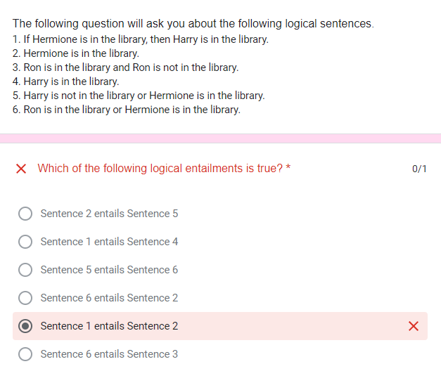

# Quiz; Wrong answer

## Chose Logical Sentence

### Entailment

`α ⊨ β`

- α entails β
- any world where α is true, β is true

### Question

### Wrong answer

Sentence1 entails Sentence2 means;
- `Library(Hermione) -> Library(Harry) ⊨ Library(Hermione)`
- = in every world that `Library(Hermione) -> Library(Harry)` is true, `Library(Hermione)` is true

`Library(Hermione) -> Library(Harry)` can be true in three cases;
  1. Library(Hermione) ^ Library(Harry)
  2. ㄱLibrary(Hermione) ^ ㄱLibrary(Harry)
  3. ㄱLibrary(Hermione) ^ Library(Harry)

as you can see, in world 2 and 3, Library(Hermione) is false

So `Sentence1 entails Sentence2` is a wrong answer

### Right answer

#### Sentence2 entails Sentence5

Library(Hermione) ⊨ ㄱLibrary(Harry) ∨ Library(Hermione)

- possible world;
  1. ㄱLibrary(Harry) ^ Library(Hermione)
  2. Library(Harry) ^ Library(Hermione)
- `ㄱLibrary(Harry) ∨ Library(Hermione)` can be false at world1

#### Sentence1 entails Sentence4

Library(Hermione) -> Library(Harry) ⊨ Library(Harry)

- to `Library(Hermione) -> Library(Harry)` be true
  1. Library(Hermione) ^ Library(Harry)
  2. ㄱLibrary(Hermione) ^ ㄱLibrary(Harry)
  3. ㄱLibrary(Hermione) ^ Library(Harry)
- it can be `ㄱLibrary(Harry)` in world2

#### Sentence5 entails Sentence6

ㄱLibrary(Harry) ∨ Library(Hermione) ⊨ Library(Ron) ∨ Library(Hermione)

- to `ㄱLibrary(Harry) ∨ Library(Hermione)` be true
  1. ㄱLibrary(Harry) ^ ㄱLibrary(Hermione)
  2. Library(Harry) ^ Library(Hermione)
- possible world;
  1. Library(Ron) ^ ㄱLibrary(Harry) ^ ㄱLibrary(Hermione)
  2. ㄱLibrary(Ron) ^ ㄱLibrary(Harry) ^ ㄱLibrary(Hermione)
  3. Library(Ron) ^ Library(Harry) ^ Library(Hermione)
  4. ㄱLibrary(Ron) ^ Library(Harry) ^ Library(Hermione)
- `Library(Ron) ∨ Library(Hermione)` can be false at world3

#### Sentence6 entails Sentence2

Library(Ron) ∨ Library(Hermione) ⊨ Library(Hermione)

- to `Library(Ron) ∨ Library(Hermione)` be true
  1. Library(Ron) ^ ㄱLibrary(Hermione)
  2. ㄱLibrary(Ron) ^ Library(Hermione)
- so it can be `ㄱLibrary(Hermione)`

#### Sentence6 entails Sentence3

Library(Ron) ∨ Library(Hermione) ⊨ Library(Ron) ^ ㄱLibrary(Ron)

- `Library(Ron) ^ ㄱLibrary(Ron)` makes contradiction; equivalent false