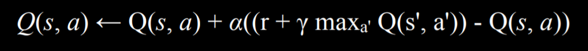

# Learning

Machine learning: instead of giving computer explicit knowledge, let it access to informations to perform task itself

## Supervised Learning

given a data set of input-output pairs, learn a function to map inputs to outputs

- `f(input1, input2, ...) = output`

### Classification

supervised learning task where the function maps an input to a discrete category

#### Nearest-neighbor classification

algorithm that chooses the class of the nearest data point to that input

#### k-nearest-neighbor classification

algorithm that chooses the the most common class out of the k nearest data points to that input

### Regression

supervised learning task where the function maps an input to a continuous value; some real number

## Unsupervised learning 

given input data without any additional feedback, learn patterns

### Clustering

organizing a set of objects into groups in such a way that similar objects tend to be in the same group

#### Example

- genetic research
- image segmentation
- market research
- medical imaging
- social network analysis

#### k-means clustering

algorithm for clustering based on repeatedly assigning points to clusters and updating those clusters' centers

- divide all of the data points to *k* different cluster centers
- iterate: move cluster centers to the center of the datas and repeat assigning process
- terminate when nothing changes

## Perceptron learning

### Hypothesis function

```
h(input1, input2, ...) = 

if (weight0 + weight1*input1 ...) >= 0:
	output1(or 1; true)
else:
	output2(or 0; false)
```

- each input is mutiplyed by own weight
	- weight: importance of the variable
- boundary: linear combination of input variables

#### Vector

- weight vector: sequence of weights
	- `w: (w0, w1, w2 ...)`
- input vector: sequence of inputs
	- `x: (1, x1, x2 ...)`
- dot product: mutiply vectors in the same sequence and add all results together
	- `w·x: w0 + w1x1 + ...`

#### Function with vector

```
hw(small w)(x) = 
if w·x >= 0:
	1
else:
	0
```

- function parameterlized by the weight

### Perceptron learning rule

given data point (x, y), update each wieght according to
`wi = wi + α(y - hw(x)) * xi`

#### Interpretation

- `y`: actual output
- `hw(x)`: what we thought; estimate

therefore
`wi = wi + α(actual value - estimate) * xi`

#### Threshold function

1. hard threshold function


- only two possible output

2. soft threshold function


## Support vector machines

when there are many choices of boundary

### Maximum margin separator

boundary that maximizes the distance between any of the data points

- can work in higher dimension
	- ex: not only linear, can be circular

## Evaluating hypotheses

### Loss function

expresses how poorly our hypothesis performs

#### 0-1 loss function

```
L(actual, predicted) = 
if actual == predicted:
	0
else:
	1
```

- can be used for classification problems

#### L1 loss function

`L(actual, predicted) = |actual - predicted|`

- 차이의 절댓값

#### L2 loss function

`L(actual, predicted) = (actual - predicted)^2`

- more harshly penalize the difference

### Overfitting

when a model fits too colsely to the particular training data set, and therefore may fail to generalize to other data sets

- minimizing loss will might cause fail to fit new data

#### Regularization

process of penalizing hypotheses that are more complex in order to favor simpler(more general) hypotheses

- can avoid overfitting this way
- `cost(h) = loss(h) + λcomplexity(h)`
	- `λ`: constant that modulate strength of penalize for complexity in cost function
	- higher `λ`, more costly complexity

#### Holdout cross-validation

splitting data into a training set and a test set, such that learning happens on the training set and is evaluated on the test set

#### k-fold cross-validation

splitting data into k sets, and experimenting k times, using each set as a test set once, and using remaining data as training set

- when training, each time leave out one dataset and use it as a test set
- end up with k different evaluation

## Reinforcement learning

given a set of rewards or punishments, learn what actions to take in the future

- agent: physical robot
- environment: where agent is situated in, where they are going to make actions
	- recieve feedback; rewards or punishments


1. environment puts agent into a state
2. agent choose to take action
3. as a result of action, agent get a new state and reward(or punishment)

## Markov decision and Q-learning

### Markov decision process

model for decision-making, representing states, actions, and their rewards

- states are chained
- multiple choices availible for one state

- `S`: set of states
- `Actions(s)`: set of actions
- `P(s'|s, a)`: transition model
	- `s, a`: given state `s` and take `a` as action
	- `s'`: next target state that we want to know probability when `s, a`
- `R(s, a, s')`: reward function

### Q-learning

method for learning a function `Q(s, a)`

- estimate of the value of performing action `a` in state `s`
- every time taking an action `a` in state `s` and observe a reward `r`, update:


	- `max a' Q(s', a')`: future reward estimate that will bring the highest reward
	- `γ`: control amount of valued future rewards

#### Process

1. start with `Q(s, a) = 0` for all `s, a`
2. when specific action receive a reward
	- estimate value of `Q(s, a)` based on current reward and expected future rewards
	- update `Q(s, a)` to take into account old estimate as well as our new estimate

#### Explore vs. exploit

- explore: explore other actions that may not be explored
- exploit: using knowledge that ai already have

have to trade of  between them

### Greedy

#### Greedy decision-making

- when in state `s`, choose action `a` with highest `Q(s, a)`
- always exploit

#### ε-greedy(epsilon-greedy)

- set `ε` equal to how often we want to move randomly
- with probability `1 - ε`, choose estimate best move
- with probability `ε`, choose random move

### function approximation

approximating `Q(s, a)` often by a function combining various features rather than storing one value for every state-action pair