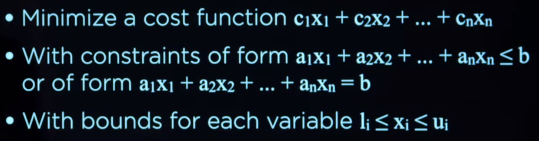
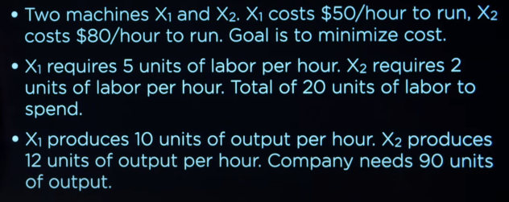
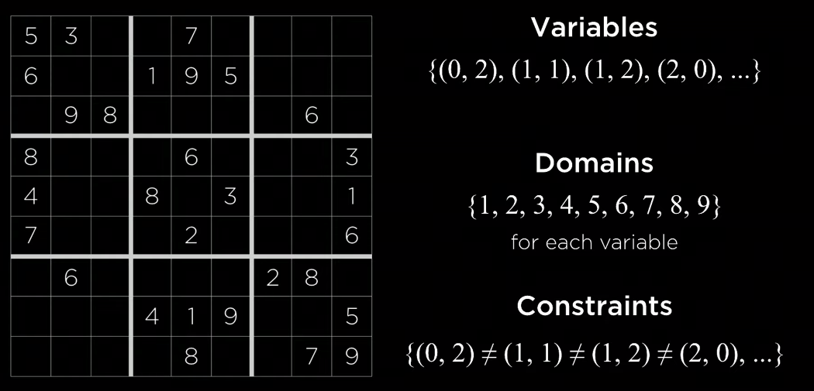

# Optimization

choosing the best option from a set of options

- local search
- linear programming
- constraint satisfaction

## Local search

search algorithms that maintain a single node and searches by moving to a neighboring node

- applicapable when just concerning to the solution, not the path
- cost: value of state
- the goal is to minimize or maximize the cost

### State-space landscape

- each bar: represent a particular state
- height of bar: function of that state; value, cost

#### Global maximum

a single state whose value is the highest

- objective function: the function that measures any given state how good is that stae

#### Global minimum

a single state whose value is the lowest

- cost function: the function that measures the cost of any given state

#### Strategy

1. take a state maintaining some current node; `current state`
2. move to neighboring state and find global maximum/mininum

## Hill climbing

the way to find maximum/minimum value:

1. consider both neighbor
2. move to neighbor that has higher/lower value
3. repeat1~2 until both neighbor is lower/higher than current state

#### Problem

can be stucked in

- local maxima/minima: the state that has no higher/lower valued neighbor(s) but not gobal maximum/minimum
- flat local maximum/minimum: states that have exact same value in a row
- shoulder: where current state and their neighbors both have equal value

there may be the better state, that is not neighbor of the current state

#### Variant

- steepest-ascent: choose the highest-valued neighbor
- stochastic: choose randomly from higher-valued neighbors
- first-choice: choose the first higher-valued neighbor
- random-restart: conduct hill climbing multiple times
- local beam search: chooses the *k* highest-valued neighbors

## Simulated annealing

allow the algorithm to dislodge itself if it gets stuck in local maximum/minimum

- early on, higher `temparature`: more likely to accept neighbors that are worse than current state
	- more likely to make random decision
- later on, lower `temparature`: less likely to accept neighbors that are worse than current state

### Pseudo code

```
def simulated-annealing(problem, max):
  current = problem.initial_state()
  for t = 1 to max:
    T = temperature(t) // when time goes on, temperature decrease
    neighbor = random(current.neighbors())
    E = gap(current, neighbor) // delta E
    if E > 0: // when neighbor is better
	current = neighbor
    else: // when neighbor is worse or equal
      with probability e^(E/T), current = neighbor
  return current
```

### Traveling salesman probelm 

minimize distance to travel

- measure the cost of the state
- using simulated annealing algorithm will be helpful

## Linear programming

family of problems that optimize a linear equation(`y = ax₁ + bx₂ ... `)

- cost function to minimize
- constraint represented as a sum of variables that is either less than or equal to a value
- bounds for each variables



### Example



## Constraint satisfaction

class of problems where variables need to be assigned values while satisfying some conditions

- set of variables
- set of domains for each variable
	- variables may have all the same domain or different domains
- set of contraints

### Example



### Constraints

- hard constraint: must be satisfied
- soft constraint:  express some notion of which solutions are preferred over others

- unary constraint: involves only one variable
- binary constraint: involves two variables

## Consistency

- consistent: 일관된, 거듭되는, 일치하는
- consistency: 일관성, 농도
- arc: 호

### Node consistency

when all the values in a variable's domain satisfy the variable's unary constraints

- remove domain that does not satisfy variable's unary constraints

### Arc consistency

when all the values in a variable's domain satisfy the variable's binary constraints

#### Method

to make *X* arc-consistent with respect to *Y*

- remove elemnet from *X*'s domain until every choice for *X* has a possible choice for *Y*

#### Revise

function to make *X* arc-consistent with *Y*

```
def revise(csp, X, Y):
  revised = false
  for x in X.domain:
    if no y in Y.domain satisfies constraint(X, Y):
      delete x from X.domain
      revised = true
  return revised
```

- csp: constraint satisfaction problem

#### AC-3

```
def AC-3(csp):
  queue = all arcs in csp
  while queue not empty:
    (X, Y) = queue.dequeue()
    if revise(csp, X, Y):
      if X.domain.size() == 0:
        return false
      for Z in X.neighbors - Y:
        queue.enqueue((Z, X))
  return true
```

- if there are chages during `revise()`, then there might be new arcs that need to be added at queue

## Backtracking search

#### Constraint satisfaction problems as search problems

- initial state: empty assignment with no variables
- actions: add {variable = value} to assignment
- trasition model: shows how adding an assignment changes the assignment
- goal test: check if all variables assigned and constraints all satisfied
- path cost function: all paths have same cost

this is inefficient

### Concept

- make assignment from variables to values
- recursively try values
- if stuck, go ahead to back track

#### Pseudo code

```
def back-track(assignment, csp):
  if assignment complete: // = all the variables being assigned
    return assignment
  variable = select-unassigned-variable(assignment, csp)
  for value in domain-value(variable, assignment, csp):
    if consistent(assignment, value):
      assignment.add({variable = value})
      result = back-track(assignment, csp)
      if result != fail:
        return result
    assignment.remove({variable = value})
  return fail
```

### Maintaining arc-consistency

algorithm for enforcing arc-consistency every time we make a new assignment

- interleaving backtracking search with inference is more efficient

#### Method

when we make a new assignment to *X* calls `AC-3` starting with a queue of all arcs *(Y,X)* where *Y* is neighbor of *X*

#### Pseudo code

```
def back-track(assignment, csp):
  if assignment complete: // = all the variables being assigned
    return assignment
  variable = select-unassigned-variable(assignment, csp)
  for value in domain-value(variable, assignment, csp):
    if consistent(assignment, value):
      assignment.add({variable = value})
      inferences = inference(assignment, csp)
      if inferences != failure:
        assignment.add(inferences)
      result = back-track(assignment, csp)
      if result != fail:
        return result
    assignment.remove({variable = value})
    assignment.remove(inferences)
  return fail
```

### Select unassigned variable

#### Minimum Remaining Values (MRV) heuristic

select the variable that has the smallest(number of) domain

#### Degree heuristic

select the variable that has the highest degree

- degree: how many arcs connect a variable to other variables

#### Least constraining values heuristic

return the variables in order by number of choices that are ruled out for neighboring variables

- trying least contraining values have less chance of leading to the solution