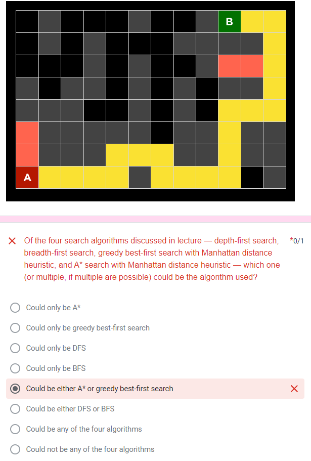
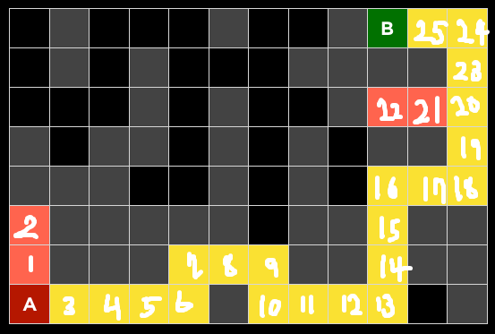

# Wrong answers review

## Find the used algorithm

### reason of choosing wrong answer

- 일단 가능한 모든 루트로 가보지 않았으니 BFS는 아님
- A*S와 Greedy-firstS는 가능함(아래 풀이 첨부)
- 오답의 이유: DFS라면 잘못된 루트로 더 많이 갔을 거라고 생각

### solving

#### DFS

#### BFS

#### Greedy-first search

#### A* search

### right answer

여전히 모르겠음.. 