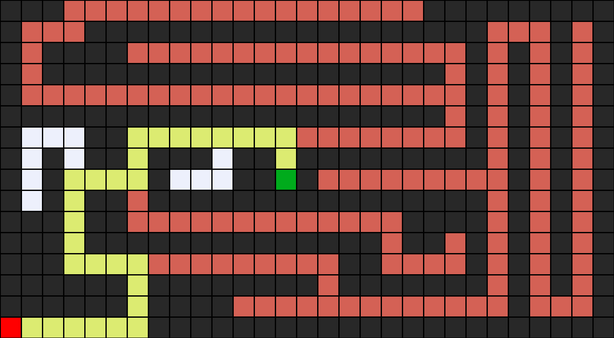

# Search 1

## Terminology & Definition

1. agent
- entity that perceives its environment and acts upon that environment
- ex: the person who try to solve the puzzle

2. state
- a configuration of the agent and its environment
- ex: figure of tiles of the puzzle; require different solutions

3. initial state
- the state in which the agent begins

4. actions
- choices that can be made in a state
- Actions(*s*) will return the set of actions that can be executed in state *s*

5. transition model
- a description of what state results from performing any applicable action in any state
- Result(*s,a*) will return the state resulting from performing action *a* in state *s*
- if action *a* changes, result will be changed

6. state space:
- the set of all states reachable from the initial state by any sequence of actions
- can draw a diagram; sequence represented as arrows and individual states

7. goal test
- way to determine whether a given state is a goal state

8. path cost
- numerical cost associated with a given path

9. search problems
- = initial state, actions, transition model, goal test, and path cost fuction

10. solution
- a sequence of actions that leads form the initial state to a goal state

11. optimal solution
- a solution that has the lowest path cost among all solutions

### Node

a data structure that keeps track of

- a state
- a parent; node that generated this node
- an action; applied to parent to get node
- a path cost; form initial state to node

## Approach

### Common Approach

#### Start

- with a frontier that contains the initial state

#### Repeat

- if frontier is empty(= nothing left to explore): no solution
- remove a node from the frontier
- if node contains goal state: return the solution
- expand node; add resulting nodes to the frontier

#### Problem & Solution

- can cause infinite loop

***

***

- frontier: `A` -> `B` -> `A, C` -> `C, B` -> `A` -> ...
- solution: don't go back to the state once visited

### Revised Approach

### Start

- with a frontier that contains the initial state
- **with an empty explored set**

#### Repeat

- if frontier is empty(= nothing left to explore): no solution
- remove a node from the frontier
- if node contains goal state: return the solution
- **add the node to the explored set**
- expand node; add resulting nodes to the frontier **if they aren't already in the frontier or the explored set**

## Search

### Depth-first search

- search algorithm that always expands the deepest node in the frontier
- based on stack(LIFO)
- follow one rute until it heat the end

#### Example

***

***

- frontier: `A` -> `B, D` -> `B, E` -> `B` -> `C` -> empty

- `yellow`: the solution
- `red`: explored but not part of the solution
- `white`: unexplored

#### Pros

- takes the least possible time to get to a solution

#### Cons

- found solution may not be optimal

### Breadth-first search

- search algorithm that always expands the shallowest node in the frontier
- based on queue(FIFO)

#### Example

***

***

- frontier: `A` -> `B, D` -> `D, C` -> `C, E` -> `E` -> empty

- takes one step in each possible direction before taking a second step in any one direction

#### Pros

- guaranteed to find the optimal solution

#### Cons

- take longer time than minimal, even takes longest possible time

### Uninformed search

- search strategy that uses no problem-specific knowledge

### Informed search

- search strategy that uses problem-specific knowledge to find solutions more efficiently
- ex: in maze, choosing geographically close rute first