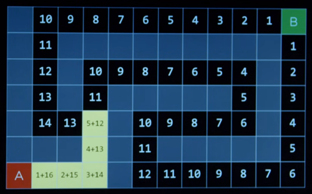

# Search 2

## Greedy best-first search

search algorithm that expands the node that is closest to the goal

- estimate the closest node from the goal by a heuristic function *h(n)*
- efficiency depends on the heuristic function

### Heuristic function

estimates cost to goal

- estimates how close to the goal the next node is
- can be mistaken
- ex: in maze, use manhattan distance to decide closer tile to the goal

## A* search

search algorithm that expands node with the lowest values of *g(n) + h(n)*

- *g(n)*: cost to reach node; steps to take to get to the position
- keep moving to the minimal `cost of path until now + estimated cost to the goal` = *g(n) + h(n)*
- example



### Optimal if

1. *h(n)* is admissible = never overestimates the true cost
   
2. *h(n)* is consistent = for every node *n* and successor *n'* with step cost *c*, *h(n) <= h(n') +c*

## Adversarial Search

search that have opponent who tries to achieve the opposite goal

- there are more than one agent
- ex: tic-tac-toe game

### Minimax

an algorithm in adversarial search

- considers all cases possible
- represents winning conditions in numeric score
- ex: `player1 winning = 1`, `tie = 0`, `player2 winning = -1`
- `MAX` aims to maximize score
- ex: player1 is `MAX` tries to maximize score; for player1 winning condition or at least tie
- `MIN` aims to minimize score

#### Functions

- *S0*: initial state; the grid
- Player(*s*): returns which player to move in state *s*; the player who is moving this turn
- Actions(*s*): returns legal moves *a* in state *s*; return possible actions
- Result(*s, a*): returns state after action *a* taken in state *s*
- Terminal(*s*): checks if state *s* is a terminal state; checks if somebody made three in a row
- Utility(*s*): final numerical value for terminal state *s*
- Max-Value(*s*): maximal value for the given state
- Max-Value(*s*): minimum value for the given state

#### Algorithm

given state *s*
- `MAX` picks action *a* in Actions(*s*) that produces highest value of Min-Value(Result(*s*, *a*))
- `MIN` picks action *a* in Actions(*s*) that produces lowest value of Max-Value(Result(*s*, *a*))

``` python
function Max-Value(state):
  if Terminal(state):
    return Utility(state)

  v = -infinity
  for action in Actions(state):
    # try to maximize the value
    v = Max(v, Min-Value(Result(state, action)))
  return v	
```

``` python
function Min-Value(state):
  if Terminal(state):
    return Utility(state)

  v = infinity
  for action in Actions(state):
    # try to minimize the value
    v = Min(v, Max-Value(Result(state, action)))
  return v	
```

### Alpha-beta pruning

way to optimize minimax

- ignore the action if that have possibility of bringing opponent better score than the already established action

example


- the player is `MAX`
- opponent is `MIN`
- it ignores the actions under `4` because they have possibility of bringing opponent better score than the already established action

### Depth-limited minimax

stop considering cases after certain number of moves

#### Evaluation function

estimates the expected utility of the game from a given state