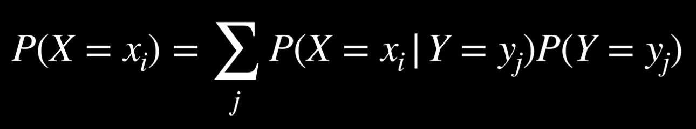

# Uncertainty 1

## Probability

### Possible world

*`ω`*

- each of possible world has their own probability

### Probability of the world

*` P(ω)`*

- 0(impossible) <= *` P(ω)`* <= 1(certain to happen/inevitable)

  -  `Ω`: every possible event
  - sum of probability of every possible world is 1; certainly occurs

### Unconditional probability

degree of belief in a proposition in the absence of any other evidence

### Conditional probability

degree of belief in a proposition given some evidence that has already been revealed

- have some initial knowledge about the world

#### Marks

*`P(a|b)`*

-*`a`*: the world we want to know the probability

-*`b`*: evidence; information that we already know for certain; true
- example: *`P(tomorrow weather | today weather)`*

### Calculation

*`P(a|b) = P(a^b) / P(b)`*

#### Example

*`P(sum of two dices is 12 | one of the dice is 6)`* = 1/6

because
- *`P(one of the dice is 6)`* = 1/6
- *`P(sum of two dices is 12 ^ one of the dice is 6)`* = 1/36

#### Derived formula

- *`P(a^b) = P(b)P(a|b)`*
- *`P(a^b) = P(a)P(b|a)`*

### Random variable

a variable in probability theory with a domain of possible values it can take on

#### Example

*`Dice {1,2,3,4,5,6}`*
- *`P(Dice = 6) = 1/6`*

*`Flight {on time, delayed, cancelled}`*
- *`P(Flight = on time) = 0.6`*
- *`P(Flight) = <0.6, 0.3, 0.1>`*
  - represented using vector

#### Independence

the knowledge that one event occurs does not affect the probability of the other event

- cannot influence each other
- events *a* and *b* are independent if and only if the probability of *a* and *b* is equal to the probability of *a* times the probability of *b*: *`P(a ∧ b) = P(a)P(b)`*

### Bayes' rule

*`P(a^b) = P(a)P(b|a)`*
*`P(a^b) = P(b)P(a|b)`*

both of them are true; so,

*`P(a)P(b|a) = P(b)P(a|b)`*

therefore,

*`P(b|a) = P(b)P(a|b) / P(a)`*

*`P(a|b) = P(a)P(b|a) / P(b)`*

#### Generalization

we can calculate *`P(a|b)`* from *`P(b|a)`*

### Joint probability

likelihood of multiple events all occurring

- probability distribution of each of the possible combinations

#### Example


```
P(C|rain) 
= P(C, rain) / P(rain) 
= αP(C, rain) 
= α<0.08, 0.02> 
= <0.8, 0.2>
```

- `,` means `and`, equal to `^`

- factoring out `α` leaves us with the proportions of the probabilities of the possible values of C given that there is rain in the afternoon
- if there is rain in the afternoon, the proportion of the probabilities of clouds in the morning and no clouds in the morning is `0.08:0.02`
- this is the probability distribution for the random variable C, we know that they should sum up to 1; need to normalize the values by computing α such that `α0.08 + α0.02 = 1`

## Probability rules

집합/확률의 공식과 유사함

### Negation

*`P(¬a) = 1 - P(a)`*

### Inclusion-Exclusion

*`P(a ∨ b) = P(a) + P(b) - P(a ∧ b)`*

- *`- P(a^b)`* 는 *`P(a)`* 와 *`P(b)`* 의 교집합만큼 중복된 부분을 빼주는 것; remove double-counted

### Marginalization

*`P(a) = P(a, b) + P(a, ¬b)`*


- `j` is every possible world
- so `Yj` can be `y`, `¬y`
- 밑에 conditioning에서도 마찬가지

#### Conditioning

*`P(a) = P(a | b)P(b) + P(a | ¬b)P(¬b)`*

