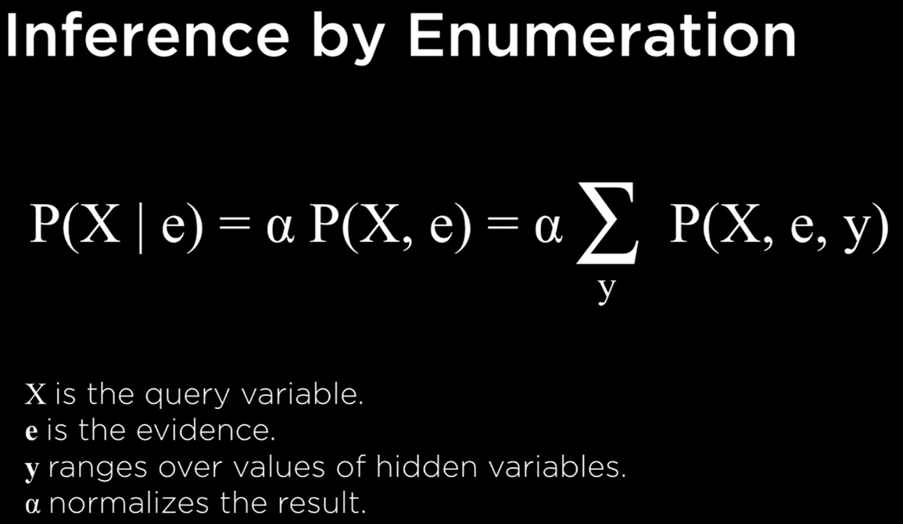

# Uncertainty 2

## Bayesian network

data structure that represents the dependencies among random variables

- directed graph; nodes connected with each other by arrows
- each node represents a random variable
- arrow from *X* to *Y* means *X* is a parent of *Y*
- each node *X* has probability distribution *`P(X|Parents(X))`*

- node that has no arrows pointing into it;
    - its probability distribution is not conditional
- node can be pointed by more than one arrow

### Inference

- query X: variable for which to compute distribution
- evidence variable E: observed variables for event **e**
- hidden variables Y: non-evidence, non-query variable

- goal: calculate *`P(X|e)`*

## Sampling

a technique for approximate inference

- each variable is sampled for a value according to its probability distribution
- can get approximate probability
- discarded the samples that did not match the evidence that we had

### Likelihood weighting

- start by fixing the values for evidence variables
  - rather than sample everything
- sample the non-evidence variables using conditional probabilities in the Bayesian network
- wheight each sample by its **likelihood**: the probability of all of the evidence

For example, if we have the observation that the train was on time, we will start sampling as before. We sample a value of Rain given its probability distribution, then Maintenance, but when we get to Train - we always give it the observed value, in our case, on time. Then we proceed and sample Appointment based on its probability distribution given Train = on time. Now that this sample exists, we weight it by the conditional probability of the observed variable given its sampled parents. That is, if we sampled Rain and got light, and then we sampled Maintenance and got yes, then we will weight this sample by P(Train = on time | light, yes).

## Markov models

the assumption that the current state depends on only a finite fixed number of previous states

### Markov chain

a sequence of random variables where the distribution of each variable folloew the Markov assumption

#### Transition model

description of how we transition to one state to next state

- specify the probability distributions of the next event based on the possible values of the current event
- can begin the construct of Markov chain

### Hidden Markov model

a Markov model for a system with hidden states that generate some observed event

- hidden state + observation
- can infer something about hidden state from observation

#### Sensor Markov assumption

the assumption that the evidence variable depends only the coressponding state

#### Tasks

tasks that can achieved by hidden Markov model

- filtering
  - given observations form start until now, calcuate distribution for current state
- prediction
  - given observations from start until now, calculate distribution for a future state
- smoothing
  - given observations from start until now, calcuate distribution for past state
- most likely explanation
  - givem observations form start until now, calculate most likely sequence of states